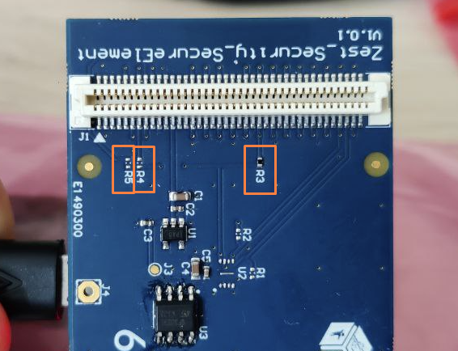

# ST - STSELib Module for Zephyr OS

This is a Zephyr module that automatically imports the [ST STSELib](https://github.com/STMicroelectronics/STSELib) library.

> [!note]
>
> This repository is licensed under [Apache-2.0](LICENSE) to remain consistent with the rest of the 6TRON libraries.
> The integrated **STSELib** itself is linked through the [v1.1.3 release](https://github.com/STMicroelectronics/STSELib/releases/tag/v1.1.3), pinned by commit [`562f3ef`](https://github.com/STMicroelectronics/STSELib/commit/562f3ef804dc3687b5cb4a0ab0a9e26fe7ecd6a6) in the [`west.yml`](west.yml).

## Options
The following Kconfig options are available:
- `CONFIG_LIB_STSELIB`: Enable STSELib support.
- `CONFIG_STSAFE_A120` or `CONFIG_STSAFE_A110`: Select the specific STSafe chip you are using.

Options can be set in your project's `prj.conf` file or through `menuconfig` (`west build -t menuconfig`).
```
menuconfig
  ├─ modules
  │  └─ st-stsafe-a1xx
  │     ST STSafe A1xx  --->
  │        [*] Enable ST STSELib support
  │           STSAFE Chip (STSAFE A120)  --->
  └─ ...
```


## Usage

- Update the device tree by adding the `stsafereset-gpios` definition and enabling the `i2c` bus to the `app.overlay` file. Adjust the `DIOx` with the souded resistors on your board.
  ```dts
  #include <zephyr/dt-bindings/gpio/sixtron-header.h>

  / {
    zephyr,user {
      stsafereset-gpios = <&sixtron_connector DIO1 GPIO_ACTIVE_HIGH>; // R3
        //stsafereset-gpios = <&sixtron_connector DIO6 GPIO_ACTIVE_HIGH>; // R4
        // stsafereset-gpios = <&sixtron_connector DIO11 GPIO_ACTIVE_HIGH>; // R5
    };
  };

  &sixtron_i2c {
    status = "okay";
    clock-frequency = <I2C_BITRATE_STANDARD>;
  };
  ```

- Include the STSELib header in your application code.
  ```c
  #include "stselib.h"
  ```



## Sample Application
Sample applications demonstrating the usage of the STSELib can be found in the `samples/` directory of this repository.
