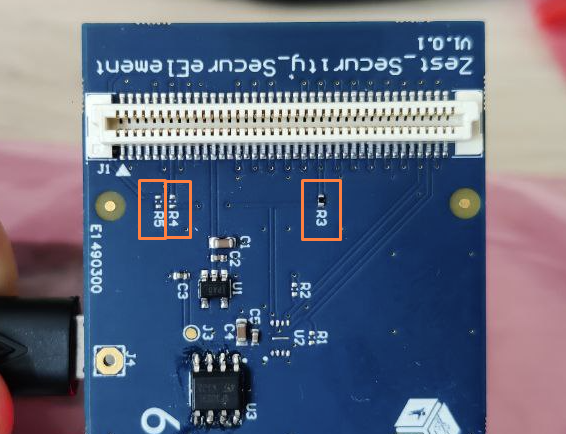

# ST - STSELib Module for Zephyr OS

This is a Zephyr module that automatically imports the [ST STSELib](https://github.com/STMicroelectronics/STSELib) library.

> [!note]
>
> This repository is licensed under [Apache-2.0](LICENSE) to remain consistent with the rest of the 6TRON libraries.
> The integrated **STSELib** itself is linked through the [v1.2.0 release](https://github.com/STMicroelectronics/STSELib/releases/tag/v1.2.0), pinned by commit [`dc93a1c`](https://github.com/STMicroelectronics/STSELib/commit/dc93a1c41ed630c8f2178f29630c1c27d004c228) in the [`west.yml`](west.yml).

## Options
The following Kconfig options are available:

| Option | Type | Default | Description |
|--------|------|---------|-------------|
| `CONFIG_LIB_STSELIB` | bool | n | Enable STSELib support. Requires `SHIELD_ZEST_SECURITY_SECUREELEMENT`. |
| `CONFIG_STSAFE_A120` | bool | y | Select the STSAFE A120 chip. |
| `CONFIG_STSAFE_A110` | bool | n | Select the STSAFE A110 chip. |
| `CONFIG_STSE_FRAME_DEBUG` | bool | n | Enable STSE frame debug output. |
| `CONFIG_STSE_USE_HOST_SESSION` | bool | n | Enable host session for secure channel. Selects `BUILD_WITH_TFM`. |
| `CONFIG_STSE_ECC` | bool | n | Enable ECC support. |
| `CONFIG_STSE_ECC_NIST_P_256` | bool | y | Enable NIST P-256 curve support (requires `STSE_ECC`). |
| `CONFIG_STSE_ECC_NIST_P_384` | bool | n | Enable NIST P-384 curve support (requires `STSE_ECC`). |
| `CONFIG_STSE_ECC_NIST_P_521` | bool | n | Enable NIST P-521 curve support (requires `STSE_ECC`). |
| `CONFIG_STSE_USE_RSP_POLLING` | bool | y | Use polling for the RSP pin instead of interrupt. |
| `CONFIG_STSE_MAX_POLLING_RETRY` | int | 10 | Maximum number of polling retries (requires `STSE_USE_RSP_POLLING`). |
| `CONFIG_STSE_FIRST_POLLING_INTERVAL` | int | 33 | Initial polling interval in milliseconds (requires `STSE_USE_RSP_POLLING`). |
| `CONFIG_STSE_POLLING_RETRY_INTERVAL` | int | 100 | Polling retry interval in milliseconds (requires `STSE_USE_RSP_POLLING`). |

Options can be set in your project's `prj.conf` file or through `menuconfig` (`west build -t menuconfig`).
```
menuconfig
  ├─ modules
  │  └─ st-stsafe-a1xx
  │     ST STSafe A1xx  --->
  │        [*] Enable ST STSELib support
  │           [ ] Enable STSE Frame Debug
  │           [ ] Enable host session for secure channel
  │           [ ] Enable ECC support
  │              [*] Enable NIST P-256 curve support
  │              [ ] Enable NIST P-384 curve support
  │              [ ] Enable NIST P-521 curve support
  │           STSAFE Chip (STSAFE A120)  --->
  │           [*] Use polling for RSP pin
  │              (10)  Maximum number of polling retries
  │              (33)  Initial polling interval in milliseconds
  │              (100) Polling retry interval in milliseconds
  └─ ...
```


## Usage

- Update the device tree by adding the `stsafereset-gpios` definition and enabling the `i2c` bus to the `app.overlay` file. Adjust the `DIOx` with the souded resistors on your board.
  ```dts
  #include <zephyr/dt-bindings/gpio/sixtron-header.h>

  ZEST_SECURITY_SECUREELEMENT(1)

  &sixtron_i2c {
    status = "okay";
    clock-frequency = <I2C_BITRATE_STANDARD>;
  };
  ```

- Include the STSELib header in your application code.
  ```c
  #include "stselib.h"
  ```



## Sample Application
Sample applications demonstrating the usage of the STSELib can be found in the `samples/` directory of this repository.
