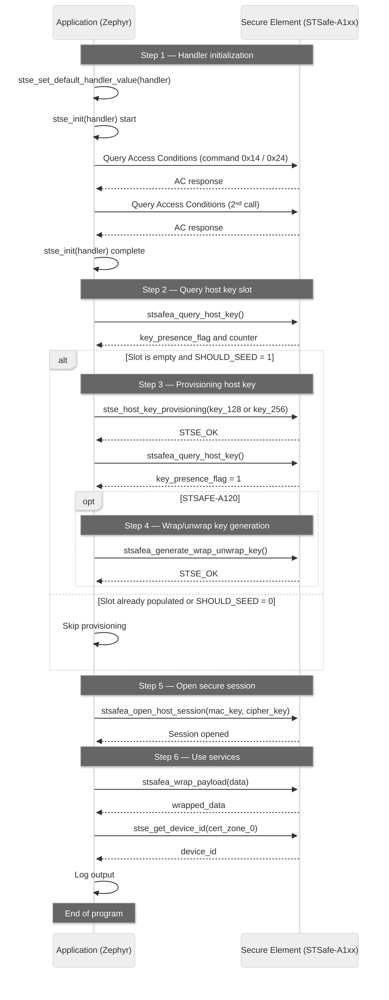

# Zephyr Zest Security Secure Element Example
This example demonstrates how to use the Zephyr Zest Security Secure Element (STSafe-A1xx) with a focus on setting up the secure element, managing keys, and establishing secure channels.

## Usage
If there is no keys already set in your secure element and you want to seed them, set the `SHOULD_SEED_HOST_KEY_SLOT` macro to `1` in `app/src/main.c[11]`. This will seed the host key slot with a default key. If you also want to debugs frames, uncomment the `#define STSE_FRAME_DEBUG_LOG` in the `app/include/stselib.h[14]` file.

## Building and Flashing
To build and flash the application, use the following commands:
```bash
west build -b zest_core_nrf5340/nrf5340/cpuapp/ns app_workspace/zephyr_zest_security_secure-element_example/app/ --pristine

west flash
```

## Current exchanges

